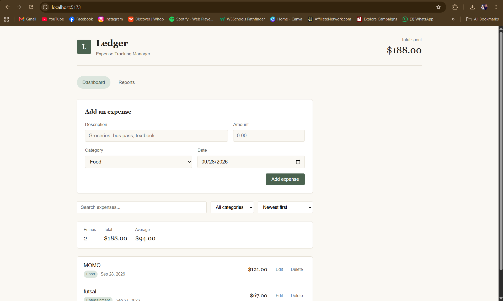
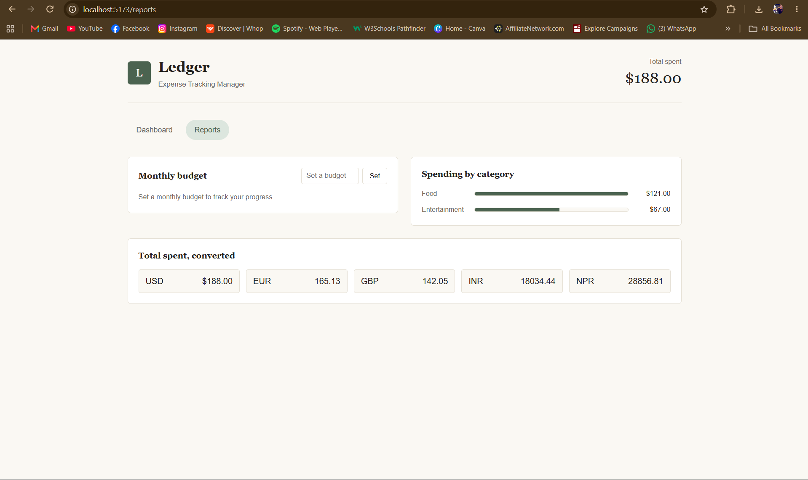

# Ledger - Expense Tracking Manager

Ledger is a React single-page application for logging and understanding personal spending. Users can add, edit, search, filter, sort, and delete expenses, track spending against a monthly budget, view a category breakdown, and see their total converted into other currencies using live exchange rates. All data is saved in the browser, so no backend or account is needed.

This project was built for the React Course Project (Option 2: Personal Expense Tracker).

## Screenshots

| Dashboard | Reports |
| --- | --- |
|  |  |

## Features

- Add expenses with description, amount, category, and date
- Edit and delete existing expenses
- Form validation with inline error messages
- Search expenses by description
- Filter expenses by category
- Sort by newest, oldest, highest amount, or lowest amount
- Live summary of entry count, total, and average for the visible list
- Category-wise spending breakdown shown as bar charts
- Monthly budget tracker with a progress bar and near-limit / over-budget warnings
- Live currency conversion of total spending using a public exchange-rate API
- Two-page navigation (Dashboard and Reports) using React Router
- Shared app state using the Context API
- Data persisted with localStorage, so it survives page refreshes
- Empty states, loading state, and error state for the API request
- Responsive layout for desktop and mobile

## Technologies Used

- React 18 (functional components and hooks only)
- React Router DOM 6 (client-side routing)
- Context API (shared state)
- Axios (API requests)
- Vite (dev server and build tool)
- CSS (custom styles, no UI framework)
- Browser localStorage (persistence)
- Public API: [open.er-api.com](https://open.er-api.com) (free, no API key required)

## Setup Instructions

Make sure [Node.js](https://nodejs.org) is installed, then run:

```bash
# 1. Clone the repository
git clone https://github.com/your-username/expense-tracking-manager.git

# 2. Go into the project folder
cd expense-tracking-manager

# 3. Install dependencies
npm install

# 4. Start the development server
npm run dev
```

Open the local URL shown in the terminal (usually http://localhost:5173).

To create a production build:

```bash
npm run build
```

## Project Structure

```
src/
├── components/
│   ├── Header.jsx
│   ├── NavBar.jsx
│   ├── ExpenseForm.jsx
│   ├── ExpenseFilters.jsx
│   ├── ExpenseList.jsx
│   ├── ExpenseItem.jsx
│   ├── SummaryPanel.jsx
│   ├── CategoryBreakdown.jsx
│   ├── BudgetTracker.jsx
│   ├── CurrencyConverter.jsx
│   └── EmptyState.jsx
├── pages/
│   ├── Dashboard.jsx
│   └── Reports.jsx
├── context/
│   └── ExpenseContext.jsx
├── services/
│   └── currencyService.js
├── utils/
│   ├── storage.js
│   └── helpers.js
├── App.jsx
├── main.jsx
└── index.css
```

## How the Requirements Are Met

- **Reusable components:** 11 components plus 2 page components, each with one responsibility.
- **Props:** data and callbacks flow from parent to child (for example `ExpenseList` passes `onEdit` and `onDelete` to `ExpenseItem`).
- **useState:** used for the form fields, filters, editing state, and API status.
- **useEffect:** syncs expenses and budget to localStorage, and fetches exchange rates on mount.
- **List rendering:** `.map()` with unique `key` props for expenses, categories, and currencies.
- **Controlled form:** `ExpenseForm` uses `onChange` and `onSubmit` with validation.
- **Conditional rendering:** empty state, loading and error messages, and budget warning states.
- **React Router:** Dashboard (`/`) and Reports (`/reports`) views.
- **Responsive layout:** CSS grid and media queries for desktop and mobile widths.

## Known Limitations

- The app tracks expenses only. Income entries and a running income minus expenses balance are not implemented.
- Data is stored per browser in localStorage, so it does not sync across devices and is lost if browser storage is cleared.
- Currency conversion needs an internet connection and depends on a free third-party API. If the request fails, only the USD total is shown.
- Amounts are shown in USD only.
- There is no pagination, so a very large number of expenses will show as one long list.
- There are no automated tests. The app was tested manually.
